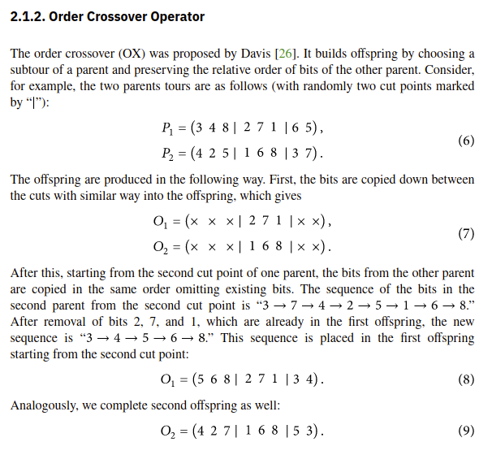
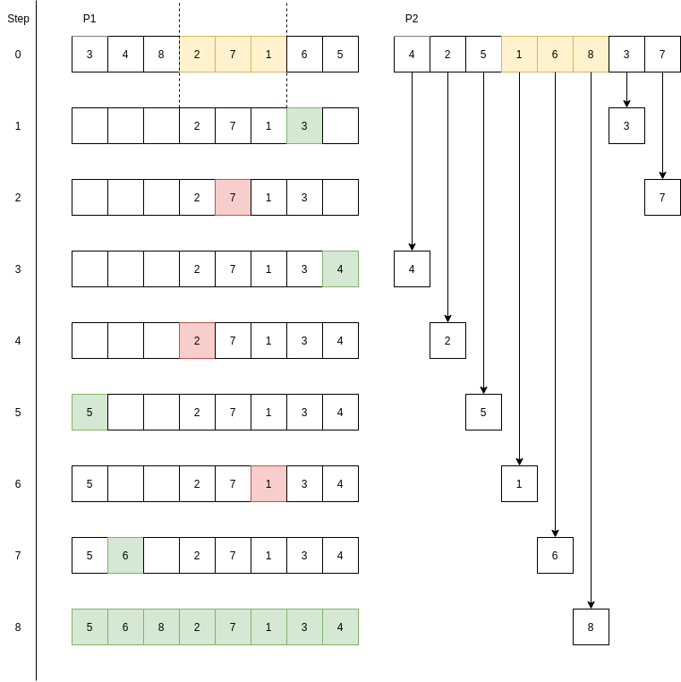

# «Survival of the Fittest» – En Intuitiv Introduksjon Til Evolusjonære Algoritmer

## Notater

- Skriver i førsteperson og refererer til leseren som "deg/du"

## TODOS

-

## Introduksjon

Det kan ofte virke som maskinlæring og "AI" krever en master i lineær algebra,
en PhD i statistikk og 10 års erfaring med Python.
I denne artikkelen skal jeg vise deg en liten snarvei,
og heller bruke det vi allerede vet fungerer fra biologien – Evolusjonære Algoritmer (EA).
EA bruker konsepter som reproduksjon, mutasjon og «fitness»
til å gjøre alt fra å lære roboter å gå, til å løse reelle optimaliseringsproblemer hos NASA.
Dette gjør de i tillegg på en intuitiv måte som alle kan forstå, uten noen forkunnskap.

I denne artikkelen skal jeg gå gjennom de grunnleggende stegene i en evolusjonær algoritme,
og gi et praktisk eksempel i Kotlin på hvordan vi kan bruke disse til å
approksimere Traveling Salesperson Problem (TSP).

**Disclaimer**: _Jeg har aldri skrevet Kotlin før, så det blir nok ikke den ryddigste koden du har sett._
I tillegg er det et par variabler rundt omkring i koden som er definert utenfor scopet som er vist, men
som ikke defineres eksplisitt i artikkelen for å gjøre ting litt ryddigere.
F.eks. `random` fra Kotlin, konstanter som `POPULATION_SIZE`, støttefunksjoner for å skrive ut løsninger og lignende.

Den endelige koden kan du finne [her](https://github.com/stianste/evolutionary-TSP).

## TSP – Selve Problemet

Som nevnt innledningsvis skal vi bruke EA til å approksimere Traveling Salesperson Problem som eksempel for å forstå teknikkene.
Da kan det være greit å ta en rask gjennomgang av hva
problemet faktisk er. Wikipedia beskriver TSP
på [følgende vis](https://en.wikipedia.org/wiki/Travelling_salesman_problem):

> Given a list of cities and the distances between each pair of cities,
> what is the shortest possible route that visits each city and returns to the origin city?

Så et eksempel kan formuleres som: «Gitt at vi starter i Oslo, hva er den korteste ruten vi kan ta for å besøke
alle byene i Norge og havne tilbake i Oslo?»

De som har hatt fag som Algoritmer og Datastrukturer eller tilsvarende, husker kanskje at dette er et
NP-Hardt problem. Uten å gå i for mye detaljer vil det si at problemet er veldig vanskelig.
Det betyr også at om jeg gir deg en løsning og
sier «hei, her har du den korteste ruten for å besøke alle byer i Norge», så
kan ikke du engang _verifisere_ at min foreslåtte løsning stemmer (i polynomisk tid alle fall).

Om dette ikke gir 100% mening trenger du ikke uroe deg. Det viktigste vi må vite er at problemet, så vidt
vi vet i dag i alle fall, ikke lar seg løse direkte. Vi må derfor ta til takke med å _approksimere_ en løsning.

I denne artikkelen kommer vi derfor til å ta for oss noen mindre eksempler av TSP som vi allerede vet løsningen på, slik at vi kan
verifisere at approksimeringen vår er ok.
Mer spesifikt fant jeg [denne siden](https://people.sc.fsu.edu/~jburkardt/datasets/tsp/tsp.html)
med noen mindre datasett.
Her finner vi blant annet FIVE problemet som som har korteste løsning på 19.
Den har en distansematrise som ser slik ut:

```
0.0  3.0  4.0  2.0  7.0
3.0  0.0  4.0  6.0  3.0
4.0  4.0  0.0  5.0  8.0
2.0  6.0  5.0  0.0  6.0
7.0  3.0  8.0  6.0  0.0
```

Det vil si at distansen mellom by 1 og by 2 er 3,0. Om dette er 3,0 km eller 3,0 mil spiller egentlig ingen
rolle. Tilsvarende er distansen mellom by 1 og by 3, 4,0. Distansen mellom by 2 og by 4 er 6.0 – også videre.
Legg merke til at matrisen er symmetrisk og at diagonalen er 0.0 for alle verdier. Dette er forventet ettersom
lengden fra by 1 til by 3 vil være den samme som fra by 3 til by 1, og lengden fra en by til seg selv vil være 0.

Om vi kikker på løsningen for problemet så er den 1 -> 3 -> 2 -> 5 -> 4. Altså at vi starter i by 1, drar til by 3, så til by 2,
etterfulgt av by 5, og til slutt by 4. Om vi leser av distansematrisen får vi da `4.0 + 4.0 + 3.0 + 6.0 = 17`.
I tillegg må vi, slik problemet er beskrevet, tilbake til by 1. Distansen fra 4 til by 1 er 2.0, så da lander vi på `19` som
er den optimale løsningen for dette problemet.

Vi skal bruke FIVE eksempelet for å verifisere at algoritmen kommer fram til en sti av lengde 19.
I tillegg skal vi bruke P01 og FRI26 problemet
fra samme side for å få testet ut algoritmen på litt større problemer. P01 består av 15 byer og har en optimal rute på lengde 291,
mens FRI26 består av 26 byer, og har en optimal løsning på `973` i følge datasettet.

For å gi litt perspektiv på hvor vanskelig oppgavene er,
kan det være verdt å merke seg hvor stort «search space» hvert problem har –
altså hvor mange mulige løsninger det finnes.
Om kombinatorikken min fortsatt stemmer noen lunde vil det med 5 byer være 5 måter å velge den første byen på. Deretter gjenstår det 4 byer vi kan
velge å besøke. Etter at vi har valgt neste by vil det være 3 valg gjenstående, osv. Vi ender da med `5*4*3*2*1 = 5! = 120` potensielle
løsninger. Det er ikke for ille, og gjør egentlig problemet enkelt fordi vi bare kan prøve alle 120 løsningene, og velge den med kortest
lengde. Om vi tar 26 byer dog, blir det en litt annen historie. Med 26 får vi `26! = 4.0329146e+26` mulige løsninger –
også kjent som helt vanvittig mange.

Vi starter raskt med å definere matrisen for FIVE problemet i programmet vårt i Kotlin:

```kotlin
val exampleDistanceMatrix = arrayOf(
    doubleArrayOf(0.0,  3.0,  4.0,  2.0,  7.0),
    doubleArrayOf(3.0,  0.0,  4.0,  6.0,  3.0),
    doubleArrayOf(4.0,  4.0,  0.0,  5.0,  8.0),
    doubleArrayOf(2.0,  6.0,  5.0,  0.0,  6.0),
    doubleArrayOf(7.0,  3.0,  8.0,  6.0,  0.0)
)
```

## Byggesteinene i en Evolusjonær Algoritme

Så, nå som vi har fått en forståelse for problemet vi skal løse, kan vi se nærmere på verktøyet vi skal bruke.
En evolusjonær algoritme består av et par grunnleggende konsepter, samt noen enkle steg i selve algoritmen.

### Representasjon

Det første vi trenger er en form for **representasjon** av en potensiell løsning, noe også kan se på som **genomet** til løsningen.
I vårt tilfelle vet vi både hvor lang en potensiell løsning vil være (antall byer i problemet), samt de mulige verdiene byene kan ha.
Derfor vil en fornuftig representasjon i vårt tilfelle være en vektor. Andre problemer kan kreve andre representasjoner som matriser eller trær.
Om vi velger å representere løsninger via vektorer kan en mulig løsning for FIVE problemet være `[1,2,3,4,5,1]`,
altså å bare besøke alle byene i rekkefølge. Den optimale løsningen vil være vektoren `[1,3,2,5,4,1]` (som vist i forrige seksjon). Siden vi dog
vet at vi må begynne og slutte i første by, kan vi sløyfe `1` ettersom den byen er implisitt. Altså at representasjonen for den optimale løsningen
i programmet vårt blir `[3,2,5,4]`.

### Fitness

I en EA er vi også avhengig av å kunne vurdere hvor god en løsning er. Til dette bruker vi noe som vi kaller «fitness».
Fitnessen til en løsning vil påvirke sannsynligheten for at denne løsningen «overlever» og får lov til å reprodusere seg og lage nye løsninger –
akkurat som i evolusjonen! Vi må derfor definere en fitnessfunksjon som er en funksjon som tar inn en mulig løsning, or returnerer
en score på hvor god løsningen er. Denne funksjonen vil ha stor innvirkning på hvor godt algoritmen vil være i stand til å tilpasse
løsninger.

I vår tilfelle er fitnessfunksjonen relativt enkel, men ikke triviell.
Vi ønsker en funksjon som straffer løsninger hvor den resulterende ruten er lang,
og belønne korte løsninger. La oss si at verst
tenkelige løsning har en lengde på 100. Da vil vi helst at en funksjon hvor en løsning med lengde 100 har en fitness som nærmer seg 0,
mens en kort løsning har en langt høyere høy fitness.
Dessverre vet vi hverken verste eller beste mulige løsning på problemene vi skal løse.
Vi må derfor _estimere_ dette taket på funksjonen.
Jeg har valgt å bruke summen av lengste distanse mellom hver by som tak på hvor dårlig algoritmen potensielt sett kan gjøre det.
Vi kan definere en funksjon som tar maks distanse fra hver by slik:

```kotlin
fun getWorstPotentialScore(distanceMatrix: Array<DoubleArray>): Double {
    return distanceMatrix.mapNotNull {it.max()}.toTypedArray().sumByDouble { it }
}
```

Her tar vi altså maks av her rad i distansematrisen.
Det er viktig å merke se at dette er en heurestikk, og at det finnes mange forskjellige måter å estimere dette på.
Det finnes også teknikker for å bruke negativ fitness, noe jeg i ettertid lurer på hadde vært mye mer passende for dette
problemet.

Basert på infoen over, kan vi definere fitness funksjonen vår slik:

```kotlin
fun scoreFitness(solution: IntArray, distanceMatrix: Array<DoubleArray>, maxFitness: Double): Double {
    var routeLength = distanceMatrix[0][solution[0]]
    for ( i in 1 until solution.size) {
        routeLength += distanceMatrix[solution[i-1]][solution[i]]
    }

    routeLength += distanceMatrix[solution.last()][0]

    return maxFitness - routeLength
}
```

Her tar vi inn `solution`, som er den foreslåtte løsningen som vi ønsker å gi en fitness-score. Vi starter med å sette `routeLength`
til å være distansen fra by 1 til den første byen i `solution`. Deretter itererer vi bare over og legger til distansene til den totale
lengden, før vi tilslutt legger til distansen fra den siste byen i løsningen tilbake til by 1. Deretter returnerer vi `maxFitness - routeLength`,
som diskutert over.

Så for eksempel vil fitness scoren til den trivielle løsningen hvor vi besøker byene i rekkefølge være
`scoreFitness([2,3,4,5], exampleDistanceMatrix, maxFitness = 35.0) = 35.0 - (3.0 + 4.0 + 5.0 + 6.0 + 7.0) = 10.0`, mens den optimale løsningen vil
ha en fitness score på
`scoreFitness([3,2,5,4], exampleDistanceMatrix, maxFitness = 35.0) = 35.0 - 19.0 = 16.0`. Her ser vi at forskjellen mellom den trivielle løsningen
og den optimale ikke veldig stor. Det er definitivt rom for forbedring i taket og fitnessfunksjonen vår, men som et eksempel duger den godt.

### Seleksjon

Nå som vi har definert en fitnessfunksjon, kan vi evaluere alle medlemmer i en generasjon.
Basert på denne evalueringen, kan vi velge ut hvilke medlemmer som skal få muligheten til å reprodusere seg.

#### Lottery Selection

Den enkleste løsningen for seleksjon vil være å gjøre
[sannynligheten for å bli valgt proposjonal med fitnessen til hvert individ](https://en.wikipedia.org/wiki/Fitness_proportionate_selection).
Dette kan oppnåes ved å opprette en tabell hvor vi allokerer plasser for hvert medlem basert på deres fitness – et slags lotteri.
For eksempel, om vi har en populasjon på tre stykker,
og den ene har fitness `50`, den neste `30` og den siste `20`,
kan vi lage en tabell på størrelse `50 + 30 + 20 = 100`, og gi 50 plasser til det første medlemmet, 30 til det neste,
og 20 til det siste.
Dersom vi velger tilfeldig fra denne tabellen vil det da være 50/100 = 50%
sjanse for å velge medlemmet med høyest fitness, 30/100 = 30% sjanse for å velge den
med nest høyest fitness, og 20% sjanse for sistemann.

#### Tournament Selection

Jeg prøvde ut lotteriteknikken først, men resultatene ble ikke veldig gode.
Jeg valgte derfor å bytte teknikk til
[Deterministic Tournament Selection](https://en.wikipedia.org/wiki/Tournament_selection).
Denne teknikken er egentlig enda enklere,
og krever mindre ressurser enn en naiv implementasjon av lotteriet nevnt over. Den går rett og
slett ut på å velge `k` medlemmer fra populasjonen, og la disse ha et «tournament» om hvem som skal få lov å reprodusere seg.
Her finnes det mange måter for hvordan man kan gjennomføre en slik turnering, men siden vi har valgt å gjøre den _deterministisk_
sier vi rett og slett at, av de `k` medlemmene som vår så heldige å bli valgt ut til å konkurrere, så lar vi den beste vinne.

Koden for dette kan se slik ut:

```kotlin
fun deterministicTournamentSelection(
        population: Array<IntArray>,
        distanceMatrix: Array<DoubleArray>,
        worstPossibleScore: Double,
        k: Int = 10
    ): IntArray {

    val tournamentCanidates = mutableListOf(population).shuffled(random).take(k)[0]
    return tournamentCanidates.maxBy { scoreFitness(it, distanceMatrix, worstPossibleScore) }!!
}

```

Som du sikkert ser så tar denne funksjonen seg også av å score fitnessen til populasjonen vi gir den. Det følger ikke helt
«single responsibility prinsippet», men funker for en enkel demo.

Tournament Selection skaper en fin balanse mellom utforsking (ettersom det er høy sannsynlighet for å få med løsninger som ikke nødvendigvis har så
høy fitness), samtidig som den beste alltid vinner, slik at vi vil gi favør til gode løsninger. I motsetning vil lotteriet nevnt over ofte
gi favør til høyere og høyere fitness, som gjør at vi snevrer inn og utforsker mindre nye løsninger, som kan føre til at vi setter oss
fast i lokale optimum, men ikke nødvendigvis finner den beste løsningen.

For reproduksjon trenger man som oftest to parter, så jeg har også lagget en hjelpefunksjon som returnerer en tuppel med
to foreldre som har blitt valgt ut via turnament:

```kotlin
fun naturalSelectionByTournament(
        population: Array<IntArray>,
        distanceMatrix: Array<DoubleArray>,
        worstPossibleScore: Double,
        k: Int = 10
    ): Pair<IntArray, IntArray> {

    return Pair(
        deterministicTournamentSelection(population, distanceMatrix, worstPossibleScore, k),
        deterministicTournamentSelection(population, distanceMatrix, worstPossibleScore, k)
    )
}
```

Med denne måten
kan vi risikere at enkelte individer parrer seg med seg selv,
men det er detaljer som heldigvis ikke har så mye å si i den virtuelle verden.

### Reproduksjon

Etter at vi nå har en metode for å velge ut foreldre, må vi også ha en måte å la dem reprodusere seg på og lage nytt avkom.
Til dette bruker vi noe som heter «crossover».
[Crossover](<https://en.wikipedia.org/wiki/Crossover_(genetic_algorithm)>)
er rett og slett en funksjon som tar inn to (eller forsåvidt flere)
medlemmer av populasjonen, og returnerer et nytt (eller flere) individ(er)
som er en kombinasjon av sine foreldre. Hvordan teknikk man kan bruke her
avhenger av problemet vi skal løse, og representasjonen som er brukt. Om vårt problem ga mening å representere med flytallsvektorer,
kunne vi for eksempel bare sagt at avkommet bare var snittet av foreldrene. I vårt tilfelle er det dessverre ikke så enkelt –
det gir ikke mening å si at snittet av by nummer 2 og 3 er by 2.5. Vi må derfor finne på noe litt smartere.

#### Order Crossover Operator

Etter litt Googling fant jeg fram til Order Crossover Operator fra
[denne artikklen](https://www.hindawi.com/journals/cin/2017/7430125/).
Lat som jeg er, legger jeg bare ved det relevante utdraget:



Kort fortalt tar vi et vindu på en tilfeldig plass i begge foreldrene og beholder dette i begge barna. Deretter
fyller vi på med verdiene fra den andre forelderen som ikke allerede finnes i barnet, fram til alle tall er plasserte.
Denne teknikken lar oss beholde
deler av rekkefølgen som var i foreldrene, og sørger samtidig for at ingen byer blir besøkt to ganger (altså at ingen
tall gjentar seg).

Artikkelen foreslår en ny metode for å oppnå samme resultat, men jeg valgte å gjøre
det enkelt å prøve ut Order Crossover Operator først.

Jeg har i tillegg forsøkt å illustrere prosessen her:



Her er en rett fram, naiv implementasjon av Order Crossover Operator i Kotlin:

```kotlin
fun orderCrossover(parent1: IntArray, parent2: IntArray, windowSize: Int = 3): IntArray {
    val parentLengths = parent1.size
    val splitIndex = random.nextInt(parentLengths - windowSize - 1)

    val offspring = IntArray(parentLengths)

    for (i in splitIndex until splitIndex + windowSize) {
        offspring[i] = parent1[i]
    }

    var offspringBaseIndex = 0
    for (i in parent2.indices) {
        val parentIndex  = (i + splitIndex + windowSize) % parentLengths
        val offspringIndex  = (offspringBaseIndex + splitIndex + windowSize) % parentLengths
        val candidate = parent2[parentIndex]
        if (!offspring.contains(candidate)) {
            offspring[offspringIndex] = candidate
            offspringBaseIndex += 1
        }
    }

    return offspring
}
```

Her kunne og burde man også laget det andre avkommet i samme slengen, men jeg valgte heller å gjøre det enkelt og bare generere
ett barn, så heller kjøre funksjonen igjen med nye foreldre. Enda en detalj med rom for forbedring.

### Mutasjon

Det neste verktøyet vi trenger i verktøykassa vår er mutasjon. Mutasjon er nødvendig for å sørge for at vi ikke låser oss fast
i en bestemt del av søkerommet. Mutasjon er rett og slett en liten tilfeldig endring i genomet som skjer med en viss sannsynlighet.
Om representasjonen vår var binære vektorer, kunne en mulig mutasjon vært å flippe en bit med en viss sannsynlighet. Med vår representasjon går
ikke det dessverre. Jeg har i stedet valgt å, med en viss sannsynlighet, bytte om på to byer. Da sørger vi for at vi får prøvd ut nye løsninger,
samtidig som vi sørger for at ingen byer blir besøkt to ganger.

En rett fram, naiv implementasjon kan se slik ut:

```kotlin
fun mutate(genome: IntArray, mutationChance: Double = 0.01): IntArray {
    if (random.nextDouble() > mutationChance) {
        return genome
    }

    val firstSwapIndex = random.nextInt(genome.size)
    var secondSwapIndex = random.nextInt(genome.size)

    while (secondSwapIndex == firstSwapIndex)
        secondSwapIndex = random.nextInt(genome.size)

    val newGenome = genome.toMutableList()
    newGenome[firstSwapIndex] = genome[secondSwapIndex]
    newGenome[secondSwapIndex] = genome[firstSwapIndex]

    return newGenome.toIntArray()
}
```

### Replacement

Det siste verktøyet vi trenger er «replacement», som går på hvordan man går fram for å erstatte medlemmer fra forrige
generasjon i neste. Jeg forsøkte først å gjøre det enkelt og bare erstatte hele populasjonen med de nye medlemmene.
Dette funket ok, men resultatene ble drastisk bedre etter at jeg la til en funksjon som beholdt top 10% av forrige generasjon
og fjernet nederste 10% av den nye generasjonen. Dette gir favør til gode løsninger, og gjorde at algoritmen konvergerte mot en
god løsning mye raskere. En funksjon som gjør dette kan se slik ut:

```kotlin
fun combinePopulations(
        currentPopulation: Array<IntArray>,
        nextPopulation: Array<IntArray>,
        ratio: Double,
        distanceMatrix: Array<DoubleArray>,
        worstPossibleScore: Double
    ): Array<IntArray> {

    fun getTopRatioCandidatesOf(population: Array<IntArray>, ratio: Double): Array<IntArray> {
        return population.sortedBy { -1.0 * scoreFitness(it, distanceMatrix, worstPossibleScore) }
            .take((population.size * ratio).toInt()).toTypedArray()
    }

    return getTopRatioCandidatesOf(currentPopulation, 1.0 - ratio) +
            getTopRatioCandidatesOf(nextPopulation, ratio)
}

```

Her er det litt småting som kunne vært bedre, som f.eks. at utfører arbeid som allerede er gjort og scorer fitness igjen, men det er ikke
så nøye.

### Grunnleggende Steg

Nå som vi har de grunnleggende byggestenene på plass, skal vi se på hvordan vi kan sette dette sammen til en algoritme.
Stjålet skamløst fra Wikipedia så kan [basisstegene](https://en.wikipedia.org/wiki/Evolutionary_algorithm) oppsummeres som:

1. Generere en tilfeldig første generasjon

2. Fram til ønsket terminering, gjenta følgende:

- Evaluer nåværende populasjons fitness
- Velg ut de medlemmene med høyest fitness
- Lag nye medlemmer via crossover og mutasjon basert på de utvalgte medlemmene
- Erstatt tidligere medlemmer i populasjonen med nye medlemmer.

Dette er basisstegene i algoritmen, men de nøyaktige detaljene avhenger av representasjon og problemet som skal løses.
For vår del vil vi for eksempel aldri vite om vi har funnet optimal løsning, og kan derfor ikke bruke dette som kriterie for når vi
burde stoppe. Vi setter heller et tak på antall generasjoner, og velger den beste løsningen vi finner i løpet av de.

Vi trenger også en en liten hjelpefunksjon for å generere tilfeldige løsninger:

```kotlin
fun generateRandomSolution(totalNumberOfCities: Int): IntArray {
    return (1 until totalNumberOfCities).toList().shuffled(random).toIntArray()
}
```

Dette er bare en enkel funksjon som genererer en liste fra 1 til antall byer (så i FIVE eksempelet `[2,3,4,5]`),
stokker den i en tilfeldig rekkefølge og returnerer listen.

Deretter kan vi gjenta denne funksjonen for å generere en tilfeldig, initiell populasjon.

### Sy Det Hele Sammen

Nå skal vi ha alle funksjonene vi trenger til å sy det hele sammen til en fungerende algoritmen:

```kotlin
    val startTime = System.currentTimeMillis()

    val FILEPATH = p01_filepath
    val optimalSolution = if (FILEPATH == fri26_filepath) 937 else 291

    val POPULATION_SIZE = 150
    val TOURNAMENT_SIZE = POPULATION_SIZE / 5
    val MUTATION_CHANCE = 0.025
    val MAX_ITERATIONS = 100
    val WINDOW_SIZE = 2
    val NEW_OLD_POPULATION_RATIO = 0.1

    val distanceMatrix = getDistanceMatrixFromFile(FILEPATH)
    val WORST_POSSIBLE_SCORE = getWorstPotentialScore(distanceMatrix)

    println("Worst possible score: $WORST_POSSIBLE_SCORE")

    var currentPopulation = Array(POPULATION_SIZE) { generateRandomSolution(distanceMatrix.size)}
    println("Preview of initial population:")
    currentPopulation.take(10).forEach ( ::printPopulationMember )

    var bestFitness = 0.0
    var bestSolution = intArrayOf()
    var bestSolutionGeneration = 0
    var bestSolutionTime = 0L

    (0..MAX_ITERATIONS).forEach{ generationNumber ->
        val nextPopulation = mutableListOf<IntArray>()
        val generationFitnesses = DoubleArray(POPULATION_SIZE)

        (0 until POPULATION_SIZE).forEach {
            val parents = naturalSelectionByTournament(
                currentPopulation,
                distanceMatrix,
                WORST_POSSIBLE_SCORE,
                k = TOURNAMENT_SIZE
            )
            val newMember = orderCrossover(parents.first, parents.second, WINDOW_SIZE)
            val mutatedMember = mutate(newMember, MUTATION_CHANCE)

            val fitness = scoreFitness(mutatedMember, distanceMatrix, WORST_POSSIBLE_SCORE)
            generationFitnesses[it] = fitness

            if (fitness > bestFitness) {
                // Kode for å holde styr på beste resultat så langt
            }

            nextPopulation.add(mutatedMember)
        }

        val averageGenerationFitness = generationFitnesses.sum() / generationFitnesses.size
        println("Average fitness of generation $generationNumber was $averageGenerationFitness")

        currentPopulation = combinePopulations(
            currentPopulation,
            nextPopulation.toTypedArray(),
            NEW_OLD_POPULATION_RATIO,
            distanceMatrix,
            WORST_POSSIBLE_SCORE
        )
    }

    println("Finished after $MAX_ITERATIONS iterations. Best fitness: $bestFitness, " +
            "which results in route length ${WORST_POSSIBLE_SCORE - bestFitness}, " +
            "which is ${WORST_POSSIBLE_SCORE - bestFitness - optimalSolution} " +
            "away from optimal solution. " +
            "This solution was found in generation $bestSolutionGeneration " +
            "after $bestSolutionTime ms"
    )
    printPopulationMember(bestSolution)
}
```

Om man kiker nærmere på koden ser man at mye av den egentlig bare er hyperparametere, printing av info og å holde styr på fitness underveis.
Jeg har også valgt å ta ut noe av koden som oppdaterer variabler når en ny beste løsning er funnet.

For p01 problemet produserer koden noe output som:

```
Worst possible score: 1059.0
Preview of initial population:
[11, 8, 5, 10, 9, 7, 6, 2, 12, 3, 15, 14, 4, 13, ]
[4, 6, 5, 13, 15, 12, 10, 9, 14, 11, 8, 7, 3, 2, ]
[11, 9, 14, 15, 6, 2, 4, 5, 10, 3, 8, 7, 12, 13, ]
[7, 12, 13, 8, 5, 14, 6, 11, 15, 9, 2, 4, 3, 10, ]
[15, 7, 10, 6, 4, 14, 8, 2, 9, 12, 5, 11, 13, 3, ]
[11, 12, 3, 6, 8, 10, 9, 13, 5, 2, 7, 15, 4, 14, ]
[9, 5, 13, 7, 15, 12, 2, 4, 14, 3, 6, 11, 10, 8, ]
[7, 8, 2, 15, 12, 5, 11, 13, 10, 3, 4, 6, 9, 14, ]
[9, 6, 13, 11, 14, 8, 2, 5, 12, 3, 4, 7, 15, 10, ]
[9, 15, 11, 14, 12, 5, 13, 3, 2, 6, 4, 10, 7, 8, ]
Improvement in generation number 0:
[11, 4, 14, 8, 12, 6, 10, 3, 15, 7, 9, 2, 5, 13, ]
564.0
Resulting in route length: 495.0
Average fitness of generation 0 was 562.9
.
.
.
Average fitness of generation 100 was 765.9933333333333
Finished after 100 iterations. Best fitness: 768.0, which results in route length 291.0, which is 0.0 away from optimal solution.
This solution was found in generation 59 after 172 ms.
[11, 4, 6, 8, 10, 14, 12, 3, 7, 5, 9, 15, 2, 13]
```

For FRI26 er ikke resultatene fult 100%, men fortsatt gode, og gir – etter litt tweaking av hyperparametere – følgende output:

```
Finished after 1000 iterations. Best fitness: 4656.0, which results in route length 975.0, which is 38.0 away from optimal solution. This solution was found in generation 458 after 1569 ms
[25, 24, 23, 26, 22, 21, 17, 18, 20, 19, 16, 10, 9, 8, 7, 5, 6, 4, 2, 3, 14, 15, 13, 11, 12, ]
```

Om vi kiker på fasiten til FRI26 ser vi at den er:

```
[25, 24, 23, 26, 22, 21, 17, 18, 20, 19, 16, 11, 12, 13, 15, 14, 10, 9, 8, 7, 5, 6, 4, 3, 2, ]
```

Her ser vi at algoritmen har funnet flere deler av av løsningen, men har plassert veien fra by ni til by to på feil plass, samt
noen andre byer som havner på feil sted. Det er dog fortsatt en veldig god løsning til å ha blitt funnet på 1,5 sekund, når man tar i betraktning
at det finnes `4e+26` potensielle løsninger.

### Avslutning og Framtidig Arbeid

Du har nå fått en rask innføring i de generelle byggeblokkene i en evolusjonær algoritme og, stegene den består av.
Her er det fortsatt masse rom for forbedring og leking! Det finnes for eksempel egne teknikker som «Islands» hvor man
har flere forskjellige populasjoner. Det er egentlig bare fantasien og evolusjon som setter grenser for hva man kan få til.
Her er det fritt fram for å fortsette optimalisering, leke seg med andre hyperparametere, andre fitnessfunksjoner
og masse annet snacks om man ønsker.
